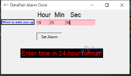

# What is Python used for 

```{note}
The content of this notebook are retrieved from the online community. Refer to the specific links for refernece. 
```

In this notebook, I would like to explore different practical reason of learning python. 

`python` can be used for 
1. AI and Machine Learning
2. Data Analytics
3. Data Visualization
4. Programming Applications
5. Web Development
6. Game Development
7. Finance
8. SEO
9. Design

For beginner, [Future Learn](https://www.futurelearn.com/info/blog/what-is-python-used-for) suggested to start with some simple project such as the following:
- build a guessing game
- design a text-based adventure game
- create a simple python calculator
- write a simple, interactive quiz
- build an alarm clock

## Project One: Alarm Clock

To dive a little deeper, I look into **how to use python to create an alarm clock**, and here is what I found on [Data Flair](https://data-flair.training/blogs/alarm-clock-python/#:~:text=of%20the%20window.-,clock%20%3D%20Tk()%20clock.,%22%2Cfont%3D60). website


### Step 1: Import all the necessary libraries and modules
```python
#Importing all the necessary libraries to form the alarm clock:
from tkinter import *
import datetime
import time
import winsound
```

### Step 2: create a while loop
```python
def alarm(set_alarm_timer):
    while True:
        time.sleep(1)
        current_time = datetime.datetime.now()
        now = current_time.strftime("%H:%M:%S")
        date = current_time.strftime("%d/%m/%Y")
        print("The Set Date is:",date)
        print(now)
        if now == set_alarm_timer:
            print("Time to Wake up")
        winsound.PlaySound("sound.wav",winsound.SND_ASYNC)
        break
def actual_time():
    set_alarm_timer = f"{hour.get()}:{min.get()}:{sec.get()}"
    alarm(set_alarm_timer)
```
### Step 3: creating GUI using tkinter

```python
clock = Tk()
clock.title("DataFlair Alarm Clock")
clock.geometry("400x200")
time_format=Label(clock, text= "Enter time in 24 hour format!", fg="red",bg="black",font="Arial").place(x=60,y=120)
addTime = Label(clock,text = "Hour  Min   Sec",font=60).place(x = 110)
setYourAlarm = Label(clock,text = "When to wake you up",fg="blue",relief = "solid",font=("Helevetica",7,"bold")).place(x=0, y=29)
# The Variables we require to set the alarm(initialization):
hour = StringVar()
min = StringVar()
sec = StringVar()
#Time required to set the alarm clock:
hourTime= Entry(clock,textvariable = hour,bg = "pink",width = 15).place(x=110,y=30)
minTime= Entry(clock,textvariable = min,bg = "pink",width = 15).place(x=150,y=30)
secTime = Entry(clock,textvariable = sec,bg = "pink",width = 15).place(x=200,y=30)
#To take the time input by user:
submit = Button(clock,text = "Set Alarm",fg="red",width = 10,command = actual_time).place(x =110,y=70)
clock.mainloop()
#Execution of the window.
```

### Step 4: save the source code and run the file

```python

python3 DataFlair-Alarm-Clock.py
```

From this website, the project will look like this after the code is completed, which is pretty cool!

> 


 **⚠Note**
 Image retrieved from online source [Data Flair](https://data-flair.training/blogs/wp-content/uploads/sites/2/2020/07/alarm-clock-run-program.png)