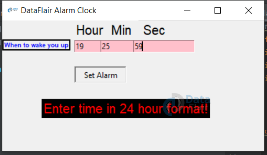

# What is Python used for 

```{note}
The content of this notebook are retrieved from the online community. Refer to the specific links for refernece. 
```

In this notebook, I would like to explore different practical reason of learning `python`. 

# `python` can be used for 

1. AI and Machine Learning
2. Data Analytic
3. Data Visualization
4. Programming Applications
5. Web Development
6. Game Development
7. Finance
8. SEO
9. Design

For beginner, [Future Learn](https://www.futurelearn.com/info/blog/what-is-python-used-for) suggested to start with some simple project such as the following:
- build a guessing game
- design a text-based adventure game
- create a simple python calculator
- write a simple, interactive quiz
- build an alarm clock

## Python's Practical Application - Alarm Clock

To dive a little deeper, I look into **how to use python to create an alarm clock**, and here is what I found on [Data Flair](https://data-flair.training/blogs/alarm-clock-python/#:~:text=of%20the%20window.-,clock%20%3D%20Tk()%20clock.,%22%2Cfont%3D60). website


### Step 1: Import all the necessary libraries and modules

```python
#Importing all the necessary libraries to form the alarm clock:
from tkinter import *
import datetime
import time
import winsound
```

### Step 2: create a while loop

```python
# create the function
def alarm(set_alarm_timer):
    while True:
        time.sleep(1)
        current_time = datetime.datetime.now()
        now = current_time.strftime("%H:%M:%S")
        date = current_time.strftime("%d/%m/%Y")
        print("The Set Date is:",date)
        print(now)
        if now == set_alarm_timer:
            print("Time to Wake up")
        winsound.PlaySound("sound.wav",winsound.SND_ASYNC)
        break
def actual_time():
    set_alarm_timer = f"{hour.get()}:{min.get()}:{sec.get()}"
    alarm(set_alarm_timer)
```

### Step 3: creating GUI using tkinter

```python
clock = Tk()
clock.title("DataFlair Alarm Clock")
clock.geometry("400x200")
time_format=Label(clock, text= "Enter time in 24 hour format!", fg="red",bg="black",font="Arial").place(x=60,y=120)
addTime = Label(clock,text = "Hour  Min   Sec",font=60).place(x = 110)
setYourAlarm = Label(clock,text = "When to wake you up",fg="blue",relief = "solid",font=("Helevetica",7,"bold")).place(x=0, y=29)
# The Variables we require to set the alarm(initialization):
hour = StringVar()
min = StringVar()
sec = StringVar()
#Time required to set the alarm clock:
hourTime= Entry(clock,textvariable = hour,bg = "pink",width = 15).place(x=110,y=30)
minTime= Entry(clock,textvariable = min,bg = "pink",width = 15).place(x=150,y=30)
secTime = Entry(clock,textvariable = sec,bg = "pink",width = 15).place(x=200,y=30)
#To take the time input by user:
submit = Button(clock,text = "Set Alarm",fg="red",width = 10,command = actual_time).place(x =110,y=70)
clock.mainloop()
#Execution of the window.
```

### Step 4: save the source code and run the file

```python
python3 DataFlair-Alarm-Clock.py
```

From this website, the project will look like this after the code is completed, which is pretty cool!

> 

 **⚠Note**
 Image retrieved from online source [Data Flair](https://data-flair.training/blogs/wp-content/uploads/sites/2/2020/07/alarm-clock-run-program.png)

## Why `python`?

I'll continue to explore the different use of `python`. From this blog post on [coursera](https://www.coursera.org/articles/what-is-python-used-for-a-beginners-guide-to-using-python), `python` is popular because of the following reasons:
1. It's **simple syntax** that is similar to natural language. It makes the language easier to read and understand for beginner to start building project
2. It's **versatile** and can be used for different types of projects from web development to machine learning
3. It's **beginner friendly**
4. It's **open source** which means it's free to use and distribute 
5. `python` archive of **module and libraries** have bundles of code that third party users created to expand its usability and capabilities
6. `python` has a **huge and active community** that contribute to it's pool of modules, library, and tools to help other programmers - it means that finding a solution for specific issue/challenges is fairly simple

## `python` for Math?

My initial understanding of python is just for math calculation. From this page on [Real Python](https://realpython.com/python-math-module/#:~:text=For%20straightforward%20mathematical%20calculations%20in,functions%2C%20are%20not%20built%20in.), it provides some context for Python Math calculation.  

For example, `math` module is a `python` package so you don't have to install separately. Use the following code to install the package.

> ```python
>import math
>```

And you can start to use it for calculation. Such as accessing the pi. Pi (π) is the ratio of a circle’s circumference (c) to its diameter (d):

>$pi = c/d$

This ratio is always the same for any circle.

You can access pi as follows:

>```python
>math.pi
>```

Another usage is for finding **Factorials with `python` factorial()**

You may have seen mathematical expressions like 7! or 4! before. The exclamation marks don’t mean that the numbers are excited. Rather, “!” is the factorial symbol. Factorials are used in finding permutations or combinations. You can determine the factorial of a number by multiplying all whole numbers from the chosen number down to 1.


For example Symbol 4! means

>$4\times 3\times 2\times 1$

I can use the following `python` code to create a for loop to solve this math problem. 

```python
def fact_recursion(num):
    if num < 0:
        return 0
    if num == 0:
        return 1

    return num * fact_recursion(num - 1)
```

These are some interesting background knowledge for me to start learning `python`. I hope to continue to document my learning journey using this `Jupyterbook`. 

Thanks for passing by!

